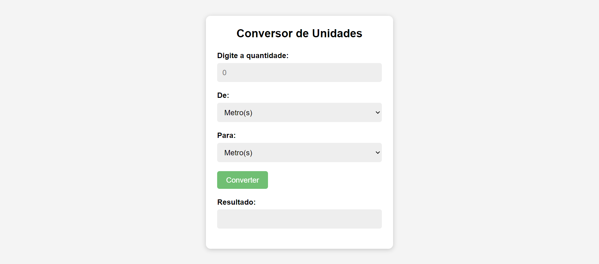

## 🖥️ Projeto

Esse é um projeto de Conversor de Unidades. Onde digitaremos a quantidade da Unidade. Colocaremos a Unidade de entrada da quantidade que colocamos. E a Unidade de saída. Teremos um botão para converter e embaixo um resultado da conversão e abaixo uma mensagem de feedback.

## 🚀 Tecnologias

Esse projeto foi desenvolvido com as seguintes tecnologias:

- HTML
- CSS
- JavaScript
- Git e Github
